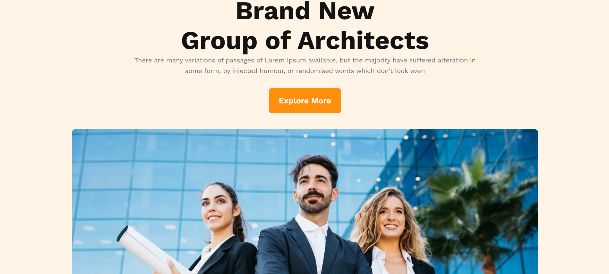

# AB Architects — Landing Page Website

[🔗 Live Demo](https://devo-ab.github.io/ab-architects/)

**AB Architects** is a sleek and minimal **landing page** representing a professional architecture team. Designed using just **HTML** and **CSS**, this page is fully responsive and tailored to highlight architectural expertise and services.

---

## ✨ Features

- ✅ Responsive layout for all devices (mobile, tablet, desktop)
- ✅ Clean and modern aesthetic
- ✅ Hero section with call to action
- ✅ Team and project showcase sections
- ✅ No frameworks — written entirely in HTML & CSS
- ✅ Lightweight and fast-loading

---

## 🛠️ Tech Stack

| Technology | Role                     |
|------------|--------------------------|
| HTML5      | Structure & content      |
| CSS3       | Styling & responsiveness |
| GitHub Pages | Hosting & deployment   |

---

## 📁 Folder Structure

```
ab-architects/
├── css/                   # Main stylesheet (style.css)
├── favicon/               # Favicon files
├── icons/                 # Icon assets
├── images/                # Project and section images
├── sponsors/              # Sponsor logos/images
├── index.html             # Main landing page
└── README.md              # Project documentation
```

---

## 📸 Screenshots

### 🖼️ Hero Section


### 🖼️ Team Showcase


### 🖼️ Preview


---

## 🚀 How to Run Locally

1. **Clone the repository**
   ```bash
   git clone https://github.com/devo-ab/ab-architects.git
   cd bangladesh
   ```

# 👤 Author

# Avi Jit

## :mailbox: Reach me out

<p align="left">
<a href="https://linkedin.com/in/itsavijitb" target="blank"></a>
<a href="https://twitter.com/itsavijitb" target="blank"></a>
<a href="https://facebook.com/itsavijitb" target="blank"></a>
<a href="https://instagram.com/itsavijitb" target="blank"></a>
</p>
